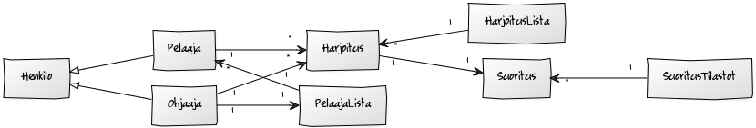
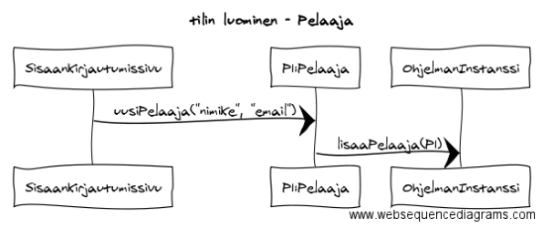

#### Aihe ja Kuvaus

**Aihe:** League of Legends harjoitustyökalu, jossa käyttäjä voi suorittaa peliin liittyviä ohjaajan luomia harjoitustehtäviä. Pelaaja ja ohjaaja kommunkoi ohjelman välityksellä. Ohjelmassa olevat harjoitustehtävät suoritetaan ohjaajan opastuksella ja määrittelemässä tahdissa.

**Käyttäjät:** pelaaja, ohjaaja

    * tilin luominen
    * ohjelmaan kirjautuminen

**pelaajan toiminnot:**

    * omien harjoitusten listaaminen
    * harjoituksen valitseminen
    * harjoitukseen liittyvien tietojen selaaminen
    * harjoituksen suoritus linkin lisääminen
    * harjoituksen suoritetuksi merkitseminen

**ohjaajan toiminnot:**

    * kaikkien harjoitusten listaaminen
    * ilman ohjaajaa olevien pelaajien listaaminen
    * pelaajan lisääminen itselle ohjattavaksi
    * harjoituksen luominen
    * harjoitukseen liittyvien tietojen lisääminen
    * harjoituksen lisääminen pelaajalle
    * pelaajan harjoituksen valitseminen
    * pelaajan harjoituksen tarkastelu
    * pelaajan suorituksen arvostelu

**Luokkakaavio**

**Rakennekuvaus**

Ohjelma on jaoteltu kolmeen ylätason pakkaukseen, logiikka, käyttöliittymä ja tiedonkäsittely. Logiikka pakkaukseen kuuluu henkilö ja harjoitus pakkaus. 

Henkilö pakkauksessa on luokat Henkilö, Pelaaja, Ohjaaja, PelaajaLista ja OhjaajaLista. Pelaaja ja Ohjaaja luokat periytyvät Henkilö luokasta joka määrittää parametrit nimike ja email. Pelaaja ja Ohjaaja luokassa on periytyneiden parametrien lisäksi määritettynä HarjoitusLista Pelaajalle ja PelaajaLista Ohjaajalle. Ohjaaja on OhjaajaListan parametri.

Harjoitus pakkauksessa on luokat Harjoitus, Suoritus, HarjoitusLista ja SuoritusTilasto. Harjoitus on HarjoitusListan parametri ja Harjoitukselle kuuluu Suoritus parametrina. SuoritusTilaston parametri on Suoritus. 

Tiedonkäsittely pakkauksessa on luokat TiedostonKäsittelijä, OhjelmanTiedot ja OhjelmanInstanssi. OhjelmanInstanssi varmistaa tiedon yhteneväisyyden ja siirtymisen ohjelman sisällä ja tämän parametreinä toimivat PelaajaLista, OhjaajaLista ja HarjoitusLista. OhjelmanTiedot luokka luo pistehavainnon listojen tilanteesta jota TiedostonKäsittelijä luokka käyttää tietojen tallentamiseen ja avaamiseen.

Käyttöliittymä pakkauksessa on luokat SisäänKirjautumissivu, OhjaajanPääsivu, PelaajanPääsivu ja HarjoituksenLuominen. Sisäänkirjautumissivu avaa tallennetut tiedot ja ohjaa käyttäjän OhjaajanPääsivulle tai PelaajanPääsivulle logiikka pakkausta hyödyntäen. OhjaajanPääsivu hyödyntää logiikka pakkausta kontrolloidessaan pelaajia, harjoituslistoja ja suorituksia. PelaajanPääsivu hyödyntää logiikka pakkausta kontrolloidessaan harjoituksia ja niihin liittyviä suorituksia. HarjoituksenLuominen käynnistyy OhjaajanPääsivulta ja hyödyntää logiikan harjoitus luokkaa luodessaan uuden harjoituksen.

**Sekvenssikaavioita**

