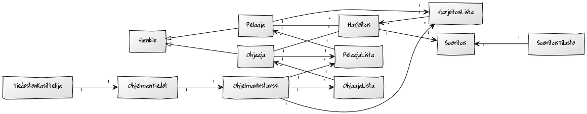
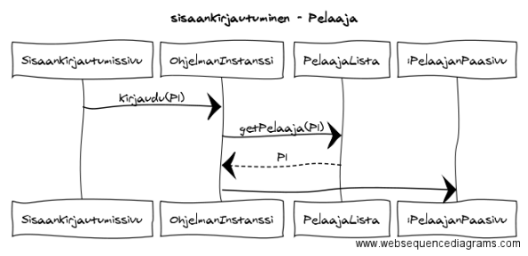

#### Aihe ja Kuvaus

**Aihe:** League of Legends harjoitustyökalu, jossa käyttäjä voi suorittaa peliin liittyviä ohjaajan luomia harjoitustehtäviä. Pelaaja ja ohjaaja kommunkoi ohjelman välityksellä. Ohjelmassa olevat harjoitustehtävät suoritetaan ohjaajan opastuksella ja määrittelemässä tahdissa.

**Käyttäjät:** pelaaja, ohjaaja

    * tilin luominen
    * ohjelmaan kirjautuminen

**pelaajan toiminnot:**

    * omien harjoitusten listaaminen
    * harjoituksen valitseminen
    * harjoitukseen liittyvien tietojen selaaminen
    * harjoituksen suoritus linkin lisääminen
    * harjoituksen suoritetuksi merkitseminen

**ohjaajan toiminnot:**

    * kaikkien harjoitusten listaaminen
    * ilman ohjaajaa olevien pelaajien listaaminen
    * pelaajan lisääminen itselle ohjattavaksi
    * harjoituksen luominen
    * harjoitukseen liittyvien tietojen lisääminen
    * harjoituksen lisääminen pelaajalle
    * pelaajan harjoituksen valitseminen
    * pelaajan harjoituksen tarkastelu
    * pelaajan suorituksen arvostelu

**Luokkakaavio**

**Sekvenssikaavioita**

